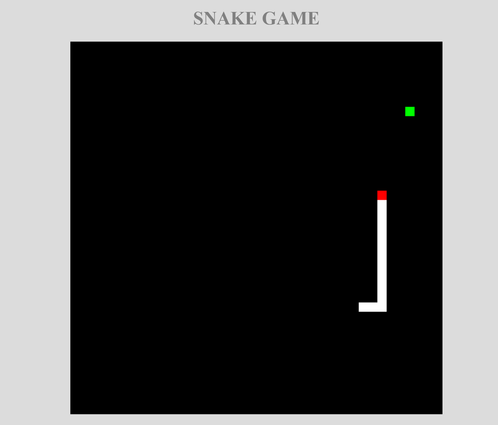

<h1>Snake Game </h1>

Basic Snake game made as Node.js practice. 

Code is not my own, game has been made by following this tutorial:

<a href="https://www.udemy.com/course/learn-modern-javascript-by-coding-a-snake-game/learn/lecture/16211576?components=buy_button,introduction_asset,purchase#overview">Learn Modern JavaScript by Coding a Snake Game</a>

Used Techniques:
- JavaScript (E56)
- Node.js
- Express.js
